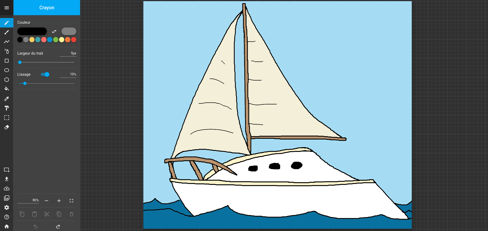

# Drawsy

A vector graphics drawing web application. Try it out here: <https://drawsy.io>.

## Features

- 12 different tools
- Undo/redo, copy/paste, selection
- Gallery to save and reload drawings
- Export drawings as SVG, PNG, or JPEG
- Multiple UI themes
- Integrated user guide

## Project layout

The repo is divided into 3 subprojects:

- [`client`](client/README.md): the web app front-end, where most of the code resides
- [`server`](server/README.md): the back-end server used to communicate with a database to save drawings
- `common`: the code used by both `client` and `server`

See each subproject's README for more information.

## Deployment

When a merge request is merged to the `master` branch, the CI/CD pipeline will automatically deploy the latest client and server to production.
